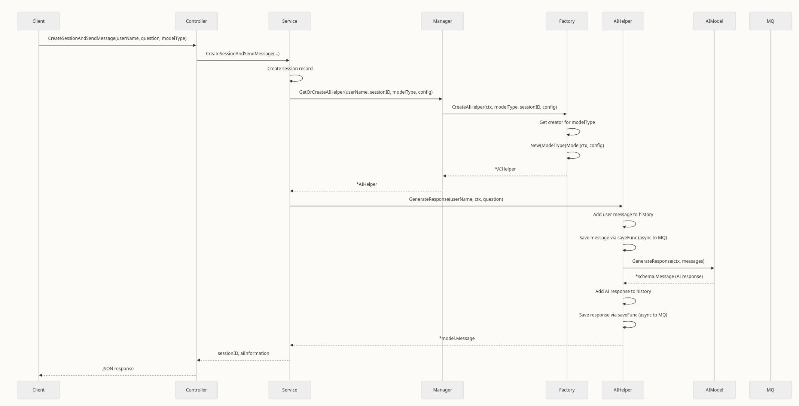
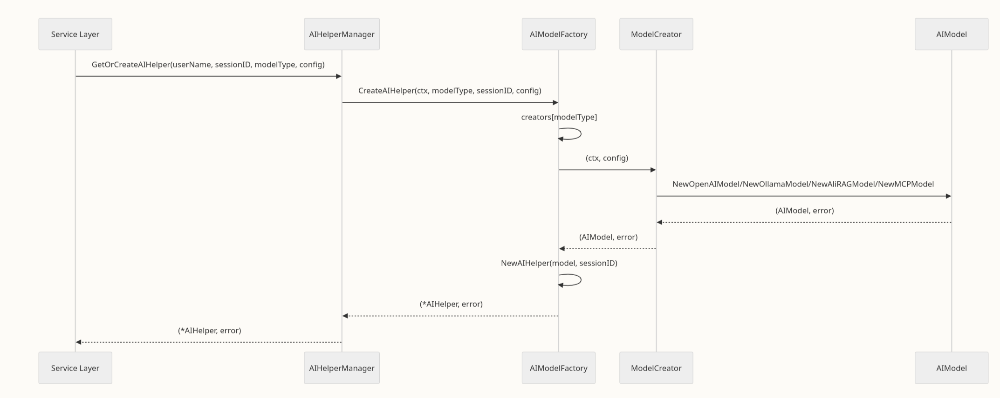

1. model.go - 模型定义层
这是最基础的文件，定义了 AI 模型的抽象接口和具体实现：

    定义 AIModel 接口（统一所有模型的交互方式）
    实现了 4 种具体模型：
        OpenAIModel - OpenAI 模型
        OllamaModel - Ollama 本地模型
        AliRAGModel - 阿里百炼 RAG 模型（增强检索生成）
        MCPModel - MCP 工具集成模型

2. factory.go - 工厂创建层
采用工厂模式，负责创建和管理不同类型的 AI 模型：

    AIModelFactory 维护一个 creators 映射表（类型编号 → 创建函数）
    registerCreators() 预注册了 4 种模型的创建方式
    CreateAIModel() 根据类型编号动态创建对应的模型实例
    支持扩展，可通过 RegisterModel() 注册新模型

3. aihelper.go - 助手应用层
这是对外提供的高层抽象，整合了消息管理和 AI 模型调用：

    AIHelper 结构体包含 AI 模型和消息历史
    AddMessage() 管理对话消息（支持自定义保存策略）
    GenerateResponse() 同步生成 AI 响应
    StreamResponse() 流式生成 AI 响应（SSE）

4. manager.go - 多会话管理层
负责管理多个用户、多个会话的 AIHelper 实例：

    AIHelperManager 维护三层映射：userName → sessionID → AIHelper
    GetOrCreateAIHelper() 获取或创建指定会话的 AIHelper（使用工厂创建）
    提供会话管理：删除会话、查询用户的所有会话等


```
调用流程（从上到下）：
┌───────────────────────────────────────────┐
│      manager.go (会话管理)                 │
│      管理多个用户的多个会话                   │
└──────────────┬────────────────────────────┘
               │ 获取/创建 AIHelper
               ↓
┌──────────────────────────────────────────┐
│        factory.go (工厂创建)              │
│   根据类型创建 AIModel 或 AIHelper         │
└──────────────┬───────────────────────────┘
               │
       ┌───────┴─────────┐
       ↓                 ↓
┌───────────────┐  ┌──────────────────┐
│  aihelper.go  │  │   model.go       │
│  组装模型      │  │  定义接口与实现     │
│  管理消息      │  │                  │
└───────┬───────┘  └──────────────────┘
        │ 使用
        ↓
┌─────────────────────────────────────────┐
│    model.go 中的具体 AI 模型              │
│  (OpenAI / Ollama / RAG / MCP)          │
└─────────────────────────────────────────┘
```
请求流程


模型创建流程
